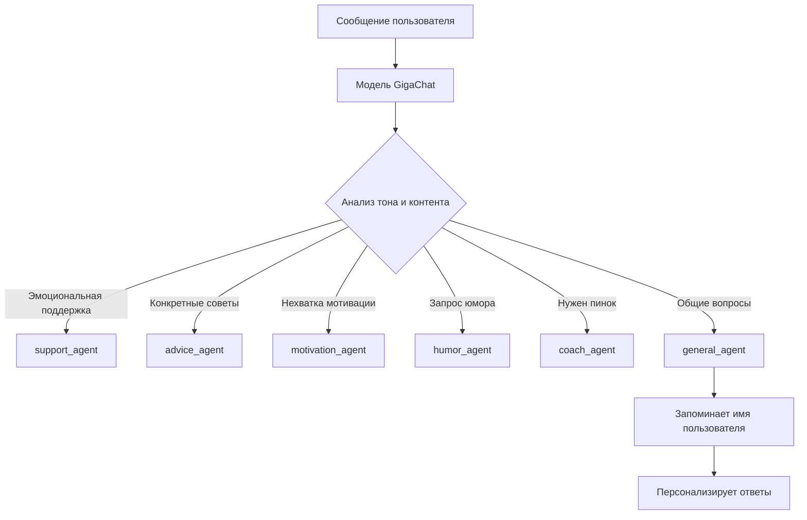

# Архитектура мультиагентного помощника

## 🎯 Агенты

| Агент | Роль | Пример использования |
| :--- | :--- | :--- |
| `support_agent` | Эмоциональная поддержка | "Я устал от тренировок" |
| `advice_agent` | Практические советы | "Как улучшить технику?" |
| `motivation_agent` | Мотивация | "Нет сил заниматься" |
| `humor_agent` | Спортивный юмор | "Расскажи шутку" |
| `coach_agent` | Строгий тренер | "Дай мне пинка!" |
| `general_agent` | Общие вопросы | "Как тебя зовут?" |
