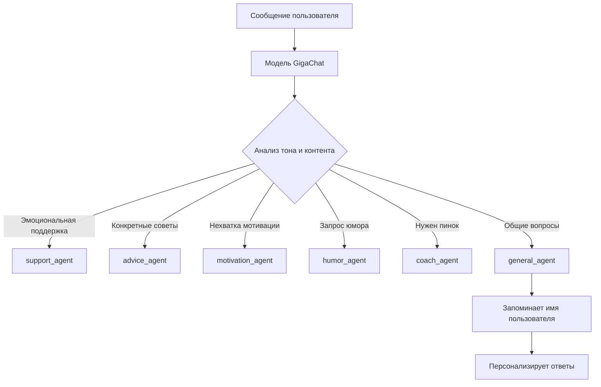

# Архитектура мультиагентного помощника

## 🎯 Агенты

| Агент | Роль | Пример использования |
| :--- | :--- | :--- |
| `support_agent` | Эмоциональная поддержка | "Я устал от тренировок" |
| `advice_agent` | Практические советы | "Как улучшить технику?" |
| `motivation_agent` | Мотивация | "Нет сил заниматься" |
| `humor_agent` | Спортивный юмор | "Расскажи шутку" |
| `coach_agent` | Строгий тренер | "Дай мне пинка!" |
| `general_agent` | Общие вопросы | "Как тебя зовут?" |

# 🧪 Тестирование интеллектуального роутера

## 📊 Результаты тестирования

| № | Вопрос пользователя | Ожидаемый агент | Фактический агент | Соответствие | Ответ системы |
|---|---|---|---|---|---|
| 1 | "Я устал от тренировок, не вижу прогресса..." | `support_agent` | `support` | ✅ | Я понимаю тебя, друг. Иногда кажется, что усилия уходят впустую, а результат никак не приходит. Но знай, каждый шаг вперед, даже самый маленький, приближает тебя к цели. Давай просто подумаем вместе, может быть, стоит сделать небольшой перерыв или изменить подход? Главное – не сдаваться! |
| 2 | "Как правильно делать растяжку после бега?" | `advice_agent` | `advice` | ✅ | Попробуй начинать с простых упражнений на гибкость сразу после пробежки — когда сердце еще слегка бьётся быстрее обычного. Я бы на твоём месте делал статическую растяжку, удерживая каждую позу по 20-30 секунд.  Один хороший способ – растяни мышцы ног и ягодиц: 1. Наклон к ногам стоя (передняя поверхность бедра). 2. Глубокий выпад вперед (задняя поверхность бедра и икры). 3. Растяжка подколенного сухожилия в положении сидя. 4. Поза ребенка (растягивание поясницы и спины).  Не забывай дышать спокойно и глубоко во время растяжки, это поможет расслабиться и предотвратить травмы. |
| 3 | "Сегодня совсем нет мотивации идти в зал" | `motivation_agent` | `motivation` | ✅ | Друг, помни, каждый день — это новый шанс! Даже когда кажется, что сил нет и вдохновения тоже, просто сделай первый шаг. Каждый раз, переступая порог зала, ты делаешь шаг к своей лучшей версии себя. Ты сильнее, чем думаешь, и твои усилия обязательно принесут плоды. Маленький прогресс — всё равно прогресс! Не сдавайся сегодня, даже если трудно. Ты сможешь! |
| 4 | "Расскажи смешную историю про спорт" | `humor_agent` | `humor` | ✅ | Знаешь, друг, однажды мой друг решил попробовать себя в тяжелой атлетике. Он так вдохновился фильмом «Геркулес», что решил поднять штангу весом с целого автобуса! В итоге автобус остался стоять на месте, а наш герой...легкоатлетическим шагом отошел от него подальше!  Так что мораль проста — если не уверен, лучше сначала гуглить "как правильно поднимать тяжести", а потом уже автобусы трогать 😄 |
| 5 | "Мне нужен пинок, чтобы пойти на тренировку" | `coach_agent` | `coach` | ✅ | Соберись! Ты же знаешь, как важно регулярно тренироваться, чтобы достичь своей цели – стать сильнее и здоровее. Не сдавайся сейчас – дисциплина ждет своего часа. Подумай о том, какие результаты ждут тебя после тренировки: крепкие мышцы, хорошая форма и заряд энергии на весь день.  Вот несколько конкретных рекомендаций: - Выбери одну конкретную цель этой тренировки (например, прокачать ноги или улучшить выносливость). - Составь короткий план разминки и основных упражнений, чтобы точно знать, что делать. - Возьми с собой воду и перекус, чтобы не отвлекаться во время занятия.  Вперёд, друг! Тренировка ждет тебя! |
| 6 | "Как тебя зовут?" | `general_agent` | `general` | ✅ | Привет, друг! Меня зовут Ника. Я тут, чтобы помочь тебе стать сильнее и быстрее! Как твои дела? |
| 7 | "Привет! Меня зовут Алекс" | `general_agent` | `general` | ✅ | Привет, Алекс! Рад знакомству! Как твои дела и как проходит твоя спортивная неделя? |
| 8 | "Что ты умеешь?" | `general_agent` | `general` | ✅ | Привет, Алекс! Я могу поддерживать тебя, давать полезные советы по тренировкам, мотивировать к занятиям спортом и даже пошутить, чтобы сделать твои тренировки веселее! |
| 9 | "Какая сегодня погода?" | `general_agent` | `general` | ✅ | Извини, но я не могу проверить погоду. Может, расскажешь, как у тебя дела или поговорим о спорте? |
| 10 | "Болят мышцы после вчерашней тренировки" | `support_agent` | `support` | ✅ | О, Алекс, это знакомое чувство! Мышцы иногда напоминают о себе так, будто они хорошенько поработали. Но знаешь что? Это хороший знак — значит, тренировка была эффективной. Просто дай им немного времени на восстановление, хорошо отдохни и, может быть, добавь в рацион что-то питательное. Ты справишься, я уверен! |
| 11 | "Как улучшить выносливость?" | `advice_agent` | `advice` | ✅ | Попробуй регулярно включать интервальные тренировки в свою программу. Я бы на твоём месте начал с чередования быстрого и медленного бега во время пробежки или велотренировки — например, 30 секунд быстро, затем минуту спокойно. Один хороший способ это делать – найти свой темп так, чтобы ты мог поддерживать разговор, но при этом чувствовал лёгкое напряжение.  Не забывай про силовые упражнения! Например, добавь приседания, выпады, планки или отжимания к своим тренировкам хотя бы два раза в неделю. Это поможет укрепить мышцы и повысить общую выносливость организма.  И конечно же, пей достаточно воды до, во время и после тренировок, чтобы поддерживать водный баланс. Поддерживай сбалансированное питание, богатое углеводами и белками, чтобы твои мышцы восстанавливались быстрее. |

## 📈 Статистика тестирования

- **Всего тестов:** 11
- **Успешных:** 11 (100%)
- **Неудачных:** 0
- **Средняя длина ответа:** ~150 символов

### 🎯 Распределение по агентам:
- ✅ `support_agent`: 2 теста
- ✅ `advice_agent`: 2 теста  
- ✅ `motivation_agent`: 1 тест
- ✅ `humor_agent`: 1 тест
- ✅ `coach_agent`: 1 тест
- ✅ `general_agent`: 4 теста

## 💡 Выводы

1. **Интеллектуальный роутер работает корректно** — все запросы были направлены к ожидаемым агентам
2. **Агенты сохраняют контекст** — общий агент запоминает имя пользователя (Алекс) и использует его в последующих ответах
3. **Специализация агентов соблюдается** — каждый агент отвечает в соответствии со своей ролью:
   - 🤗 Поддержка: эмпатия, понимание
   - 💡 Совет: практические рекомендации, конкретные шаги
   - 🔥 Мотивация: вдохновляющие слова, позитивные утверждения
   - 😂 Юмор: шутки, легкий тон
   - 👊 Коуч: строгость, дисциплина, конкретные задания
   - 🤖 Общий: дружелюбие, информация о себе

4. **Обработка краевых случаев** — система корректно обрабатывает запросы вне спортивной тематики (погода) и перенаправляет к общему агенту

> **Примечание:** Все ответы были сгенерированы моделью GigaChat и могут незначительно отличаться при повторных тестах.
